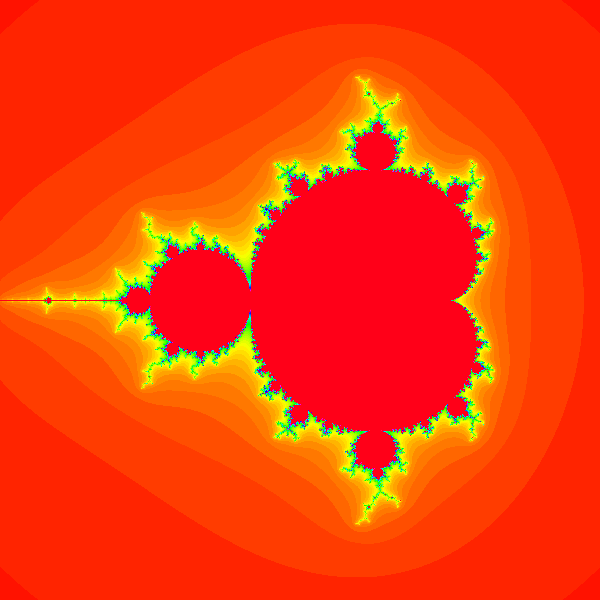
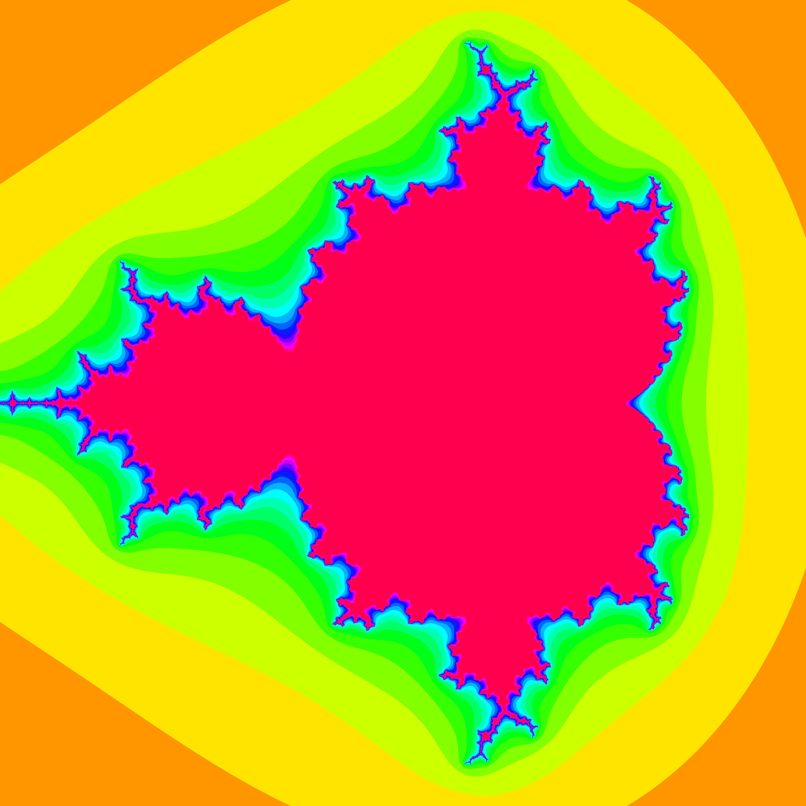

# Mandelbrot Set render
By no means an original premise, here is a home-made Mandelbrot set program written in Python.
I have written it as both a Python-facing API and a command-line program using `argparse`,
so you can use it in either manner.

## Dependencies
* PIL

Installation: `pip install Pillow`

## Usage
The program fundamentally allows you control over the following parameters:

`width` and `height`: the dimensions of the image output. This is the most impactful
value when considering the run-time of the program, so be careful, as large
values lead to vast time increases rather quickly.
Furthermore, the width and height are recommended to be equal, as anything else can lead to distortions.

`x_offset` and `y_offset`: the value by which the camera is moved before the fractal is rendered.
For example, an offset of (1, -1) would move 1 to the right and 1 down, effectively translating
the entire Mandelbrot set by (-1, 1).

`iterations`: the maximum number of times each value is passed through the Mandelbrot function before
it is deemd to be convergent. This occurs for each pixel, so increasing it will significantly affect the
run-time.

`threshold`: the value above which the squared absolute value of each pixel (z) must exceed before it is considered
divergent, and thus the loop breaks.

### From within Python
The function `render_mandelbrot` returns a PIL image, which can be saved to a file using the syntax:

`render_mandelbrot(width, height, x_offset, y_offset, zoom, iterations, threshold).save(filename).save(filename)`

Alternatively, the output image can be used for other purposes, such as rendering in a real-time application
or output to other processes, etc.

### Using the command-line
The command-line interface shows its own help menu via `python mandelbrot-cli.py --help`, but below are some examples:

* `python mandelbrot-cli.py 600 600 mandelbrot.png` (vanilla render)
* `python mandelbrot-cli.py 600 600 mandelbrot.png --zoom 2` (zoom into the center)
* `python mandelbrot-cli.py 600 600 mandelbrot.png --x-offset -0.5 --y-offset 0.1 --zoom 3` (translate and zoom)
* `python mandelbrot-cli.py 4000 4000 high_res.png --zoom 1.2` (get a high-res render)
* `python mandelbrot-cli.py 600 600 mandelbrot.png --iterations 20` (reduce iterations for better performance)
* `python mandelbrot-cli.py 600 600 mandelbrot.png --threshold 2` (change the threshold value)
* `python mandelbrot-cli.py 1080 1080 mandelbrot.png -Z 4 --dx -0.5 --dy 0 -T 36 -I 50` (all-in-one arguments)

(Note that `dx` and `dy` are the same as `x-offset` and `y-offset`; the former is simply shorter.)

#### Installation (Linux)
In order to run the program more conveniently, allowing you to type a bare `mandelbrot-cli` at the terminal, install the `mandelbrot-cli.py` file to your `bin` directory:

`sudo cp mandelbrot-cli* /usr/bin`

This exact setup only largely works on Linux, but you may achieve the same thing in Windows by adding any folder that
contains the `m̀andelbrot-cli.bat` file to the system `PATH` environment variable.

## Gallery

